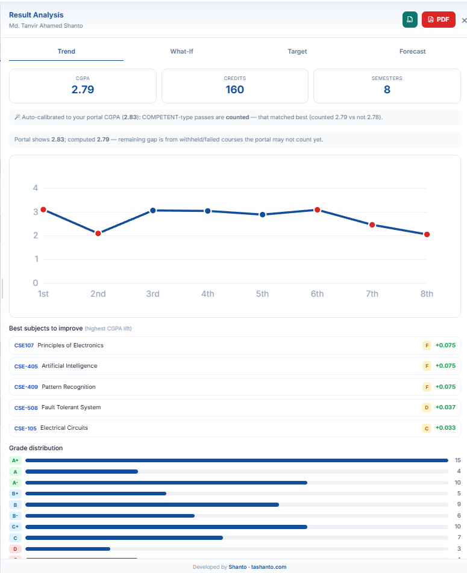
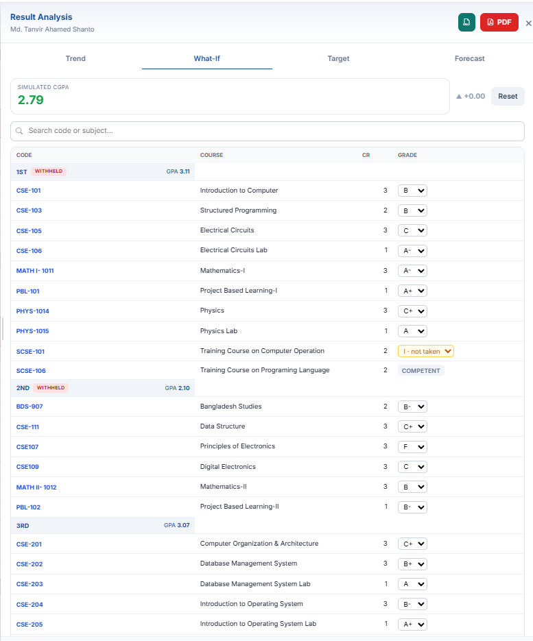
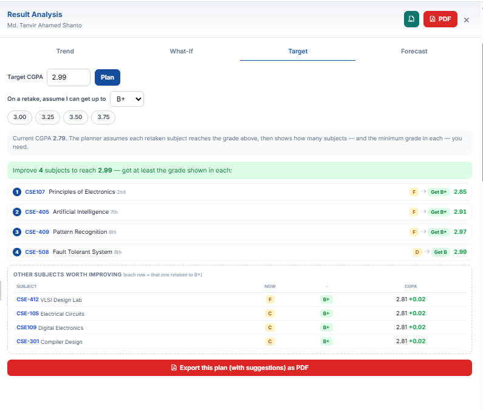
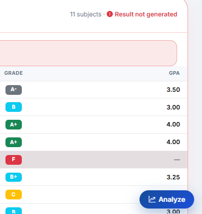

# UGV Result Analysis

A Chrome/Edge (Manifest V3) extension that adds GPA analytics, grade simulation, CGPA planning and PDF export to the **UGV Student Portal → Results** page.

## Features

- 📈 **Trend** — semester-wise GPA line chart, CGPA/credits summary, a ranked list of the subjects that would lift your CGPA the most, and a grade-distribution breakdown.
- 🧪 **What-If simulator** — change any subject's grade from a dropdown (grouped by semester) and watch your CGPA and each semester GPA recompute live. Changed subjects are highlighted, and search finds any subject fast.
- 🎯 **Target planner** — enter a goal CGPA, pick the grade you realistically expect on a retake (default **B+**), and get the fewest subjects to improve — with the minimum grade needed in each. Export the whole plan, with suggestions, as a PDF.
- 🔮 **Forecast** — safe / target / reach projections for your in-progress ("I") subjects, plus a *"what GPA do I need next semester?"* calculator for any goal CGPA and credit load.
- 📄 **PDF grade sheet** — one click opens a clean, print-optimized sheet; use the browser's *Save as PDF*.
- 📊 **CSV export** — download every course + grade point for your own spreadsheets.
- 🌗 **Theme-aware & resizable** — the panel follows the portal's own light/dark mode; drag its left edge to resize (double-click to expand full width). Width is remembered.

### What-If simulator

Grades are grouped by semester with the live GPA beside each. Standard grades (A+…F) are editable; **COMPETENT** and **I (Incomplete)** are shown as they are — an Incomplete can be given a grade to project what happens once you sit the exam.

### Target planner

The planner shows exactly which subjects to retake and the minimum grade each needs, ordered by impact, plus other subjects worth improving and the CGPA each would give on its own.

## How grades are scored

The extension **learns the grade → point scale from your own results** — every row carries a letter grade and its grade point, so the math matches what the portal computes. Grades absent from the page fall back to the standard Bangladesh 4.0 scale (`A+ 4.00 … F 0.00`), set in [src/gradeScale.js](src/gradeScale.js).

Only standard letter grades count toward CGPA. **I (Incomplete)** is excluded until you simulate a grade for it. **COMPETENT**-style pass markers are handled by auto-calibration: the extension computes your CGPA both counting and not counting them, and keeps whichever matches the portal's own published CGPA — so the number you see lines up with your grade sheet.

## Install

The extension is not on the Web Store; load it unpacked (developer mode):

1. Download this repository (green **Code → Download ZIP**, then extract) or `git clone` it.
2. Open `chrome://extensions` in Chrome, or `edge://extensions` in Edge.
3. Turn on **Developer mode** (top-right toggle).
4. Click **Load unpacked** and select the extracted `ugv-result-analysis` folder.
5. Open <https://ugv.edu.bd/student-dashboard/results> and log in.
6. Click the floating **Analyze** button at the bottom-right of the page.

After pulling new changes, return to the extensions page and click the **↻ reload** icon on the card, then refresh the results page.

## Project layout

| File | Role |
|------|------|
| [manifest.json](manifest.json) | MV3 manifest; content scripts scoped to the results URL |
| [src/gradeScale.js](src/gradeScale.js) | Grade → point scale, learned from the page + fallback |
| [src/parser.js](src/parser.js) | Reads the results page |
| [src/analysis.js](src/analysis.js) | CGPA, what-if, target planner, calibration |
| [src/pdf.js](src/pdf.js) | Grade-sheet and plan PDF generator |
| [src/ui.js](src/ui.js) | Injected panel + chart |
| [src/content.js](src/content.js) | Entry point |
| [src/popup.html](src/popup.html) | Toolbar popup |
| [test/logic.test.js](test/logic.test.js) | Math test — run with `node test/logic.test.js` |

## Notes

- The parser reads the portal's current markup. If UGV redesigns the results page, update [src/parser.js](src/parser.js).
- Retake planning assumes an improved grade replaces the old one (standard UGV rule).
- Everything runs locally in your browser; no data leaves your machine.

---

Developed by [TA Shanto](https://tashanto.com).
